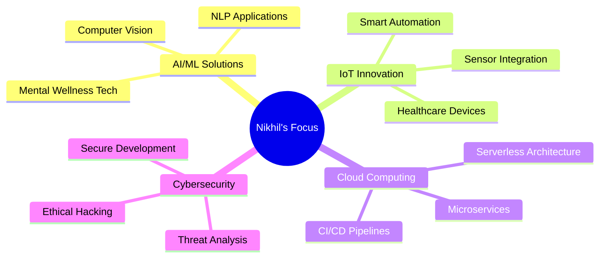

# 👋 Hi there, I'm **Nikhil Savita**

<div align="center">


</div>

---

## 🎓 **Academic Excellence**
> **4th Year Computer Science Student** at **Padre Conceicao College of Engineering**  
> **CGPA: 9.0/10** 🏆

---

## 🧠 **About Me**

```typescript
const nikhil = {
    location: "Goa, India 🇮🇳",
    education: "BE-Computer Science Engineering",
    currentFocus: ["AI/ML Solutions", "Mental Wellness Tech", "IoT Innovation"],
    learning: ["Deep Learning", "Cloud Architecture", "Cybersecurity"],
    askMeAbout: ["React", "FastAPI", "AI Integration", "IoT Development"],
    funFact: "I turn coffee into code and ideas into reality! ☕→💻"
};
```

<p align="center">
  <a href="mailto:nikhilsavita186@gmail.com">
    
  </a>
  <a href="https://nikhilsavita.vercel.app/">
    
  </a>
  <a href="https://www.linkedin.com/in/nikhilsavita186">
    
  </a>
  <a href="https://github.com/Nikhil181511">
    
  </a>
</p>

---

## 🛠️ **Tech Arsenal**

### **Languages & Frameworks**
<p align="left">
  
  
  
  
  
  
</p>

### **Cloud & DevOps**
<p align="left">
  
  
  
  
</p>

### **AI/ML & IoT**
<p align="left">
  
  
  
  
</p>

---

## 🚀 **Featured Projects**

<table>
<tr>
<td width="50%">

### 🧠 **MindWell** - AI Mental Wellness Assistant
AI-powered platform for comprehensive mental health support with mood tracking and therapy booking.

**🔧 Tech Stack:** React • FastAPI • Firebase • Gemini Pro • Ollama

[](https://ai-mental-health-assistant-chi.vercel.app/)

</td>
<td width="50%">

### 🧾 **Smart Consumer Guide** - AI Product Scanner
Intelligent barcode scanner providing AI-generated product safety insights and health recommendations.

**🔧 Tech Stack:** React • FastAPI • Gemini Pro

[](https://smart-consumer-guide.vercel.app/)

</td>
</tr>
<tr>
<td width="50%">

### 🎯 **AI Smart Presentation Generator**
Generate professional presentation slides instantly from any topic using advanced AI.

**🔧 Tech Stack:** React • FastAPI • Gemini Pro

[](https://ai-smart-presentation-generator.vercel.app/)

</td>
<td width="50%">

### 🛡️ **Safe Haven** - Emergency IoT Device
Wearable fall detection and heart rate monitoring system for elderly care with real-time alerts.

**🔧 Hardware:** ESP32-S2 • MAX30102 • MPU6050  
**🔧 Software:** Arduino • Firebase • React

</td>
</tr>
<tr>
<td width="50%">

### 🦁 **Animal Image Classifier + AI Assistant**
Deep learning-powered animal classifier with integrated AI assistant for educational facts and wildlife support.

**🔧 Tech Stack:** React • FastAPI • PyTorch • Gemini Pro

[](https://animal-classification-frontend.vercel.app/)

**🎯 Classifies:** Bear • Bird • Cat • Cow • Deer • Dog • Elephant • Fish • Giraffe • Horse • Human • Insects • Kangaroo • Lion • Panda • Reptile • Sheep • Tiger • Zebra

</td>
<td width="50%">

### 🏨 **Hotel Management System**
Comprehensive online hotel booking platform with advanced admin and staff management features.

**🔧 Tech Stack:** PHP • MySQL • JavaScript • HTML/CSS

[](https://nikhil181511.github.io/Hotel-Management/)

</td>
</tr>
</table>

---

## 🏆 **Achievements & Recognition**

<div align="center">

| 🎖️ **Achievement** | 🏛️ **Organization** | 📅 **Year** |
|:------------------:|:------------------:|:-----------:|
| **Finalist** - IDEAS Hackathon | PCCE | 2024 |
| Google Cloud Study Jams | GDSC PCCE | 2024 |
| Programming in Modern C++ | NPTEL | 2023 |
| Google Cloud Computing Foundations | Qwiklabs | 2023 |
| AIML (Honors) | PCCE | 2023 |

</div>

---

## 📊 **GitHub Analytics**

<div align="center">


</div>

<div align="center">

[](https://git.io/streak-stats)

</div>

---

## 🌟 **Current Focus Areas**



---

## 📈 **Learning Journey**

<div align="center">

```ascii
    🚀 Current Learning Path
    ┌─────────────────────────┐
    │  Deep Learning & AI     │ ████████████████████ 85%
    ├─────────────────────────┤
    │  Cloud Architecture     │ █████████████████    80%
    ├─────────────────────────┤
    │  IoT & Embedded Systems │ ██████████████████   75%
    ├─────────────────────────┤
    │  Cybersecurity          │ ████████             50%
    ├─────────────────────────┤
    │  DevOps & Automation    │ ███████████████      70%
    └─────────────────────────┘
```

</div>

---

## 💭 **Philosophy**

<div align="center">

> ### *"Learning by building. Building to solve."*
> 
> **🎯 Mission:** Creating AI-powered solutions that make a positive impact on people's lives  
> **💡 Vision:** Bridging the gap between cutting-edge technology and real-world problems  
> **🤝 Values:** Innovation • Collaboration • Continuous Learning • Social Impact

</div>

---

<div align="center">

### 🤝 **Let's Connect & Collaborate!**

*Always open to interesting conversations about technology, innovative projects, and making the world a better place through code!*

[](mailto:nikhilsavita186@gmail.com)

</div>

---

<div align="center">
  
</div>
